# ComfyUI RunningHub API Connector

[English](./README.md) | [中文](./README_CN.md)

---

🚀 **A powerful, user-friendly RunningHub API integration for ComfyUI**

This custom node suite allows you to connect your local ComfyUI instance to the [RunningHub](https://www.runninghub.cn) cloud platform. Run complex and resource-intensive workflows on high-performance cloud GPUs directly from your local ComfyUI, breaking the limitations of your local hardware.

## ✨ Key Features

- **Seamless Cloud Execution**: Run any RunningHub workflow or AI application without leaving your ComfyUI interface.
- **Comprehensive Node Suite**: Includes over 15 nodes for configuration, execution, parameter setting, file uploads, and batch processing.
- **Versatile File Handling**: Dedicated nodes for uploading images, videos, audio, latent tensors, and generic files.
- **Powerful Batch Processing**: Automate large-scale tasks by running a workflow multiple times with different parameters using our specialized batch nodes.
- **Intuitive UI**: Nodes are designed to be clear, chainable, and easy to configure.
- **Automatic Output Handling**: Automatically downloads and processes images, videos, audio, text, and latent tensors from your cloud tasks.
- **Local File Saving**: Optionally save all outputs directly to your ComfyUI output directory with organized naming.
- **Secure Configuration**: Supports an external `config.json` file to keep your API key safe and avoid repeated entry.

## 📦 Installation

### Method 1: ComfyUI Manager (Recommended)

1.  Install [ComfyUI Manager](https://github.com/ltdrdata/ComfyUI-Manager).
2.  Open ComfyUI Manager and click on `Install Custom Nodes`.
3.  Search for `ComfyUI_RH_API` and click `Install`.
4.  Restart ComfyUI.

### Method 2: Manual Installation (Git)

1.  Navigate to your ComfyUI `custom_nodes` directory:
    ```bash
    cd ComfyUI/custom_nodes/
    ```
2.  Clone this repository:
    ```bash
    git clone https://github.com/Ken-Chen-CN/ComfyUI_RH_API.git
    ```
3.  Install the required dependencies:
    ```bash
    cd ComfyUI_RH_API/
    pip install -r requirements.txt
    ```
4.  Restart ComfyUI.

## 🚀 Quick Start Guide

Get your first cloud workflow running in minutes!

1.  **Get Credentials**: Log in to [RunningHub](https://www.runninghub.cn), go to your desired workflow, click "Run with API", and copy the **Workflow ID** and **API Key**.
2.  **Configure Node**: In ComfyUI, add the `🌐 RH Config` node and paste your API Key and Workflow ID into the corresponding fields.
3.  **Execute**: Add the `▶️ RH Execute` node, connect the `config` output from the `RH Config` node to it, and click `Queue Prompt`.

That's it! The node will execute the workflow on the cloud and download the results.

```mermaid
graph TD
    A[🌐 RH Config] -- config --> B[▶️ RH Execute];
    B -- images --> C[Preview Image];
```



## 📚 Node Reference

All nodes can be found under the **Ken-Chen/RH-API** category in ComfyUI.

### Core Nodes

#### 🌐 RH Config
Configures the connection to the RunningHub API. This is the starting point for all workflows.
- **Inputs**: `api_key`, `workflow_or_app_id`, `base_url` (optional), `is_ai_app` (checkbox).
- **Outputs**: `config` (a configuration object for other RH nodes).

#### ▶️ RH Execute
Executes a cloud workflow and downloads the results.
- **Inputs**: `config`, `params` (optional), `timeout`, `save_to_local` (checkbox), `output_prefix`.
- **Outputs**: `images`, `video_frames`, `text`, `audio`, `video`, `latent`.

#### ⚙️ RH Param
Sets a single parameter for the cloud workflow. Nodes can be chained together to set multiple parameters.
- **Inputs**: `node_id`, `field_name`, `field_value`, `previous_params` (for chaining).
- **Outputs**: `params`.

### Upload Nodes

These nodes upload local data to RunningHub and can optionally create a parameter entry at the same time.

- **📤 RH Upload Image**: Uploads an image.
- **🎵 RH Load Audio Path** & **📤 RH Upload Audio**: A two-node system with a player widget to upload local audio files.
- **📤 RH Upload Video**: Uploads a video file from your `ComfyUI/input` directory.
- **📤 RH Upload File**: Uploads any generic file (e.g., `.txt`, `.json`).
- **📤 RH Upload Latent**: Uploads a latent tensor as a `.safetensors` file.

### Batch Processing Nodes

- **📤 RH Batch Upload Image**: Uploads multiple images, treating each as a parameter for a separate task run.
- **📤 RH Multi-Input Image**: Uploads multiple images to be used as different inputs within a *single* task run.
- **📦 RH Param Bundle**: Bundles multiple parameter sets together. Each set will trigger a separate task run.
- **⏯️ RH Batch Execute**: Executes a batch of tasks using a `param_bundle`.

### Utility & Advanced Nodes

- **📥 RH Download Results**: Downloads results from a previously executed `task_id`.
- **🛠️ RH Task Manager**: Get the status of a task or cancel a running task.
- **🖼️ RH Image Selector**: Selects a single image from a batch.
- **📝 RH Text Display**: Displays text output in the UI and console.

## 🔧 Advanced Usage

### Using a Configuration File (Recommended)

To avoid entering your API key repeatedly, create a `config.json` file in the `ComfyUI_RH_API` directory. Copy the contents of `config.json.example` and fill in your details.

```json
{
    "api_key": "YOUR_API_KEY_HERE",
    "base_url": "https://www.runninghub.cn"
}
```
The `RH_Config` node will automatically use these values if its own fields are left empty.

### Example Workflows

The `examples/` directory contains several pre-built workflows that demonstrate key features. Load them into ComfyUI to see how they work!

- **`basic_execute_download.json`**: The simplest text-to-image workflow.
- **`batch_processing.json`**: Demonstrates how to run multiple tasks in parallel.
- **`latent_transport.json`**: Shows how to upload a latent, process it, and download the result.
- **`workflow_inpainting_with_mask.json`**: An example of using the (currently disabled) mask upload feature.

## 🐛 Troubleshooting

- **"API key is required"**: Ensure your API key is entered correctly in the `RH_Config` node or the `config.json` file.
- **"Task timeout"**: The cloud workflow took longer than the `timeout` value in the `RH_Execute` node. Try increasing it.
- **Node Not Appearing**: Ensure you have restarted ComfyUI after installation.

## 🤝 Contributing

Contributions, issues, and feature requests are welcome! Please feel free to open an issue or submit a pull request on our [GitHub repository](https://github.com/Ken-Chen-CN/ComfyUI_RH_API).

## 📝 License

This project is licensed under the MIT License. See the [LICENSE](./LICENSE) file for details.

