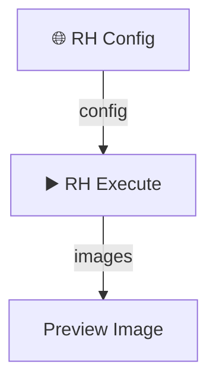

# ComfyUI RunningHub API 连接器

[English](./README.md) | [中文](./README_CN.md)

---

🚀 **一个强大、易用的 ComfyUI RunningHub API 集成插件**

这套自定义节点允许您将本地的 ComfyUI 连接到 [RunningHub](https://www.runninghub.cn) 云端平台。从此，您可以直接在本地 ComfyUI 中调用高性能云端 GPU 来运行复杂和计算密集型的工作流，打破本地硬件的限制。

## ✨ 核心功能

- **无缝云端执行**: 无需离开 ComfyUI 界面，即可运行任何 RunningHub 工作流或 AI 应用。
- **全功能节点套件**: 包含超过15个节点，涵盖配置、执行、参数设置、文件上传和批量处理。
- **多种文件处理**: 为图片、视频、音频、潜空间张量（Latent）和通用文件提供专门的上传节点。
- **强大的批量处理**: 使用专门的批处理节点，通过不同的参数多次运行工作流，实现大规模任务的自动化。
- **直观的用户界面**: 节点设计清晰、易于连接和配置。
- **自动化的输出处理**: 自动从您的云端任务下载并处理图片、视频、音频、文本和潜空间张量。
- **本地文件保存**: 可选择将所有输出结果以规范的命名方式直接保存到您的 ComfyUI 输出目录。
- **安全配置**: 支持外部 `config.json` 文件，以保护您的 API 密钥安全，并避免重复输入。

## 📦 安装方法

### 方法一：使用 ComfyUI Manager (推荐)

1.  安装 [ComfyUI Manager](https://github.com/ltdrdata/ComfyUI-Manager)。
2.  打开 ComfyUI Manager，点击 `Install Custom Nodes`。
3.  搜索 `ComfyUI_RH_API` 并点击 `Install`。
4.  重启 ComfyUI。

### 方法二：手动安装 (Git)

1.  进入 ComfyUI 的 `custom_nodes` 目录:
    ```bash
    cd ComfyUI/custom_nodes/
    ```
2.  克隆本仓库:
    ```bash
    git clone https://github.com/Ken-Chen-CN/ComfyUI_RH_API.git
    ```
3.  安装所需的依赖:
    ```bash
    cd ComfyUI_RH_API/
    pip install -r requirements.txt
    ```
4.  重启 ComfyUI。

## 🚀 快速入门指南

只需几分钟，即可运行您的第一个云端工作流！

1.  **获取凭证**: 登录 [RunningHub](https://www.runninghub.cn)，进入您想运行的工作流，点击“API调用”，然后复制 **工作流ID** 和 **API Key**。
2.  **配置节点**: 在 ComfyUI 中，添加 `🌐 RH Config` 节点，并将您的 API Key 和工作流 ID 粘贴到相应的字段中。
3.  **执行**: 添加 `▶️ RH Execute` 节点，将 `RH Config` 节点的 `config` 输出连接到它，然后点击 `Queue Prompt`。

就这么简单！节点将在云端执行工作流并下载结果。



## 📚 节点参考

所有节点都可以在 ComfyUI 的 **Ken-Chen/RH-API** 分类下找到。

### 核心节点

#### 🌐 RH Config
配置与 RunningHub API 的连接。这是所有工作流的起点。
- **输入**: `api_key`, `workflow_or_app_id`, `base_url` (可选), `is_ai_app` (复选框)。
- **输出**: `config` (供其他 RH 节点使用的配置对象)。

#### ▶️ RH Execute
执行云端工作流并下载结果。
- **输入**: `config`, `params` (可选), `timeout`, `save_to_local` (复选框), `output_prefix`。
- **输出**: `images`, `video_frames`, `text`, `audio`, `video`, `latent`。

#### ⚙️ RH Param
为云端工作流设置单个参数。可以链式连接多个节点以设置多个参数。
- **输入**: `node_id`, `field_name`, `field_value`, `previous_params` (用于链式连接)。
- **输出**: `params`。

### 上传节点

这些节点将本地数据上传到 RunningHub，并可以选择同时创建参数条目。

- **📤 RH Upload Image**: 上传一张图片。
- **🎵 RH Load Audio Path** & **📤 RH Upload Audio**: 一个包含播放器控件的双节点系统，用于上传本地音频文件。
- **📤 RH Upload Video**: 从您的 `ComfyUI/input` 目录上传视频文件。
- **📤 RH Upload File**: 上传任何通用文件 (例如 `.txt`, `.json`)。
- **📤 RH Upload Latent**: 将一个潜空间张量（Latent）作为 `.safetensors` 文件上传。

### 批处理节点

- **📤 RH Batch Upload Image**: 上传多张图片，每张图片作为一次独立任务运行的参数。
- **📤 RH Multi-Input Image**: 上传多张图片，用于*单次*任务运行中的不同输入。
- **📦 RH Param Bundle**: 将多个参数集打包在一起。每个参数集将触发一次独立任务运行。
- **⏯️ RH Batch Execute**: 使用 `param_bundle` 执行一批任务。

### 工具及高级节点

- **📥 RH Download Results**: 从一个先前已执行的 `task_id` 下载结果。
- **🛠️ RH Task Manager**: 获取任务状态或取消一个正在运行的任务。
- **🖼️ RH Image Selector**: 从一批图片中选择一张。
- **📝 RH Text Display**: 在界面和控制台中显示文本输出。

## 🔧 高级用法

### 使用配置文件 (推荐)

为了避免重复输入您的 API Key，您可以在 `ComfyUI_RH_API` 目录下创建一个 `config.json` 文件。复制 `config.json.example` 的内容并填入您的信息。

```json
{
    "api_key": "YOUR_API_KEY_HERE",
    "base_url": "https://www.runninghub.cn"
}
```
如果 `RH_Config` 节点中的相应字段为空，它将自动使用这些值。

### 示例工作流

`examples/` 目录包含多个预置的工作流，用于演示核心功能。将它们加载到 ComfyUI 中即可查看它们如何工作！

- **`basic_execute_download.json`**: 最简单的文生图工作流。
- **`batch_processing.json`**: 演示如何并行运行多个任务。
- **`latent_transport.json`**: 展示如何上传、处理并下载一个潜空间张量。
- **`workflow_inpainting_with_mask.json`**: 使用（当前已禁用）的蒙版上传功能的示例。

## 🐛 问题排查

- **"API key is required"**: 确保您已在 `RH_Config` 节点或 `config.json` 文件中正确输入了您的 API Key。
- **"Task timeout"**: 云端工作流的运行时间超过了 `RH_Execute` 节点中设置的 `timeout` 值。请尝试增加它。
- **节点未出现**: 确保您在安装后已重启 ComfyUI。

## 🤝 贡献

欢迎各种贡献、问题反馈和功能请求！请随时在我们的 [GitHub 仓库](https://github.com/Ken-Chen-CN/ComfyUI_RH_API) 中提交 Issue 或 Pull Request。

## 📝 许可证

本项目采用 MIT 许可证。详情请见 [LICENSE](./LICENSE) 文件。

